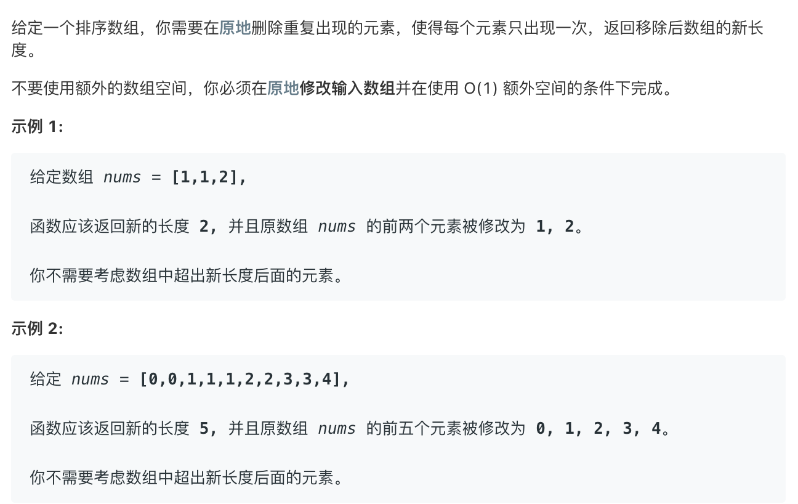

##26. Remove Duplicates from Sorted Array



### 双指针

```
class Solution {
public:
    int removeDuplicates(vector<int>& nums) {
        if (nums.size() == 0) return 0;
        int j=0;
        for(int i=1;i<nums.size();i++){
            if(nums[j] != nums[i]){
                nums[++j] = nums[i];
            }
        }
        return j+1;
    }
};
```

