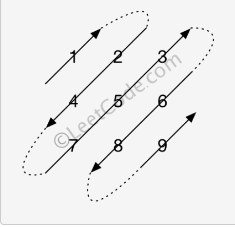

## 对角线遍历

给定一个含有 M x N 个元素的矩阵（M 行，N 列），请以对角线遍历的顺序返回这个矩阵中的所有元素，对角线遍历如下图所示。

 **示例:**

```
输入:
[
 [ 1, 2, 3 ],
 [ 4, 5, 6 ],
 [ 7, 8, 9 ]
]

输出:  [1,2,4,7,5,3,6,8,9]

解释:
```

 

**说明:**

1. 给定矩阵中的元素总数不会超过 100000 。

解答很清楚[solution](https://leetcode-cn.com/problems/diagonal-traverse/solution/dui-jiao-xian-bian-li-fen-xi-ti-mu-zhao-zhun-gui-l/)

```
class Solution {
public:
    vector<int> findDiagonalOrder(vector<vector<int>>& matrix) 
{
	vector<int> nums;
	int m = matrix.size();
	if (m == 0) return nums;
	int n = matrix[0].size();
	if (n == 0) return nums;

	bool bXFlag = true;
	for (int i = 0; i < m + n; i++)
	{
		int pm = bXFlag ? m : n;
		int pn = bXFlag ? n : m;

		int x = (i < pm) ? i : pm - 1;
		int y = i - x;                

		while (x >= 0 && y < pn)
		{
			nums.push_back(bXFlag ? matrix[x][y] : matrix[y][x]);
			x--;
			y++;
		}

		bXFlag = !bXFlag;
	}
	return nums;
}
};
```

