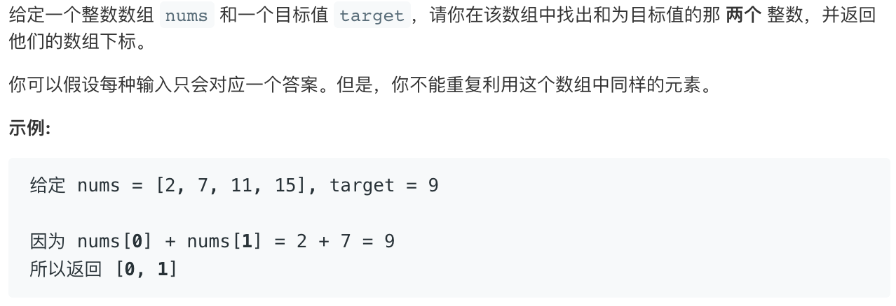

## 1. Two Sum



### 暴力解

```
class Solution {
    public int[] twoSum(int[] nums, int target) {
        int [] ans= new int [2];
        for(int i=0;i<nums.length;i++){
            for(int j=i+1;j<nums.length;j++){
                if (nums[i]+nums[j] == target){
                    ans[0]=i;
                    ans[1]=j;
                    return ans;
                }
            }
        }
        return ans;
    }
}
```

### 倒推法

