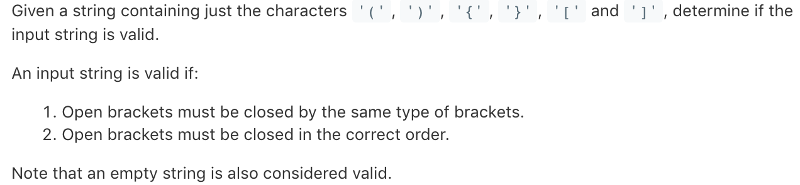

## 20. Valid Parentheses



### 使用栈

对于这种括号的匹配问题，我们很轻易的想到使用栈来进行相关的操作。

```
class Solution {
    public boolean isValid(String s) {
        if (s.length()==0){
            return true;
        }
        Stack<Character> stack=new Stack<Character>();
        for(int i=0;i<s.length();i++){
            char c=s.charAt(i);
            if(c=='('){
                stack.push(')');
            }
            else if(c=='['){
                stack.push(']');
            }
            else if(c=='{'){
                stack.push('}');
            }
            else if(stack.empty()||c!=stack.pop()){
                return false;
            }
        }
        return stack.empty();
    }
}
```

### 类似方法

思想类似，只不过是使用Map进行key，value的存储

```
class Solution {
    public boolean isValid(String s) {
        assert s != null;
        if (s.length() % 2 != 0) {
            return false;
        }
        Map<Character, Character> map = new HashMap<>();
        map.put('(', ')');
        map.put('{', '}');
        map.put('[', ']');

        Stack<Character> stack = new Stack<>();

        for (int i = 0; i < s.length(); i++) {
            char c = s.charAt(i);
            if ((c == '(' || c == '[' || c == '{') && stack.size() < s.length() - i) {
                stack.push(c);
                continue;
            }
            else if (!stack.empty() && c == map.get(stack.pop())) {
                continue;
            }
            return false;
        }
        return stack.empty();
    }
}
```

